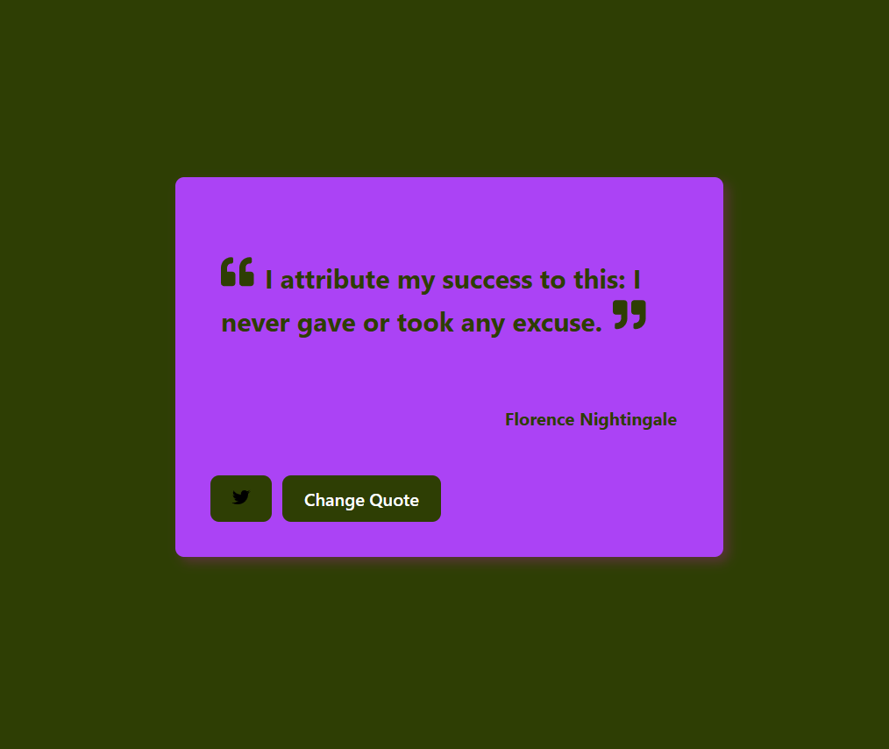

# Build-a-Random Quote Machine🚀
>This repository contains a a simple web application that displays random quotes along with their authors. Users can fetch new quotes and share them on Twitter. This project is built using React to fulfill the requirements of the freeCodeCamp Front End Development Libraries projects. This documentation serves as a guide for developers, contributors, and users to understand the architecture, implementation details, and usage instructions for the project. This project is built by React, and css. Trough creating this repository, users will learn React, and css.

**How to use this project?**
To use this project, follow these steps.
Open your browser to http://localhost:3000 to view the app.
click the "New Quote" button to fetch a new random quote.
Click the "Tweet Quote" button to share the current quote on Twitter.

**This project is created:**
React
css

**To create a Random Quote Machine:**
instal react.
create a css file.
remove the extra file from react app.

## Demo 📸

## Technologies Used 🛠️
This project is built by:
- React
- CSS

## Installation 💻
first install git and create a github account.
Create a repositpry for this project.
clone the project in local machine.
use git comments like git add. git comment, and git push.
git add: it can add our project{git add (your file name)}
git commeit: it can commit the changes.
git push: it push the changes into github.

## Usage 🎯

To use this project, follow these instructions:
1. First,  create a repositort 

clone the repository and navigate to the project directory:
open git bush and use git clone: 
git clone https://github.com/yourusername/project-name.git
   cd project-name.

2. Installation: Install the required dependencies using git:
git install

3. Configuration: Configure [Project Name] by editing the config.git file.

## Author 👩‍💻

Masoma Rezaie.

- Website: [your-website.com](https://github.com/MasomRezaie/Personal-Portfolio-Page/tree/personal-portfolio-page)
- LinkedIn: [Miss Masoma](https://www.linkedin.com/in/miss-masoma-99b85522a?utm_source=share&utm_campaign=share_via&utm_content=profile&utm_medium=android_app)
- Email: [Masoma Rezaie](masom.rezaie135@gmail.com)

## Contributing 🤝

Those who want to contribute in this project with me, can reach out me through:
email:masom.rezaie135@gmail.com
